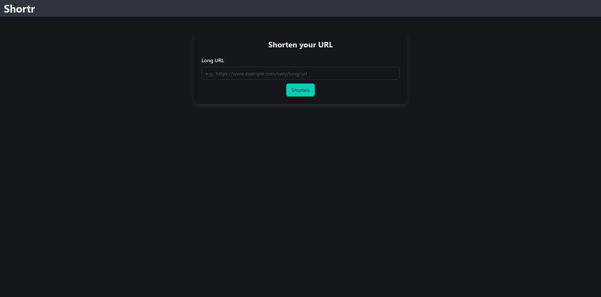
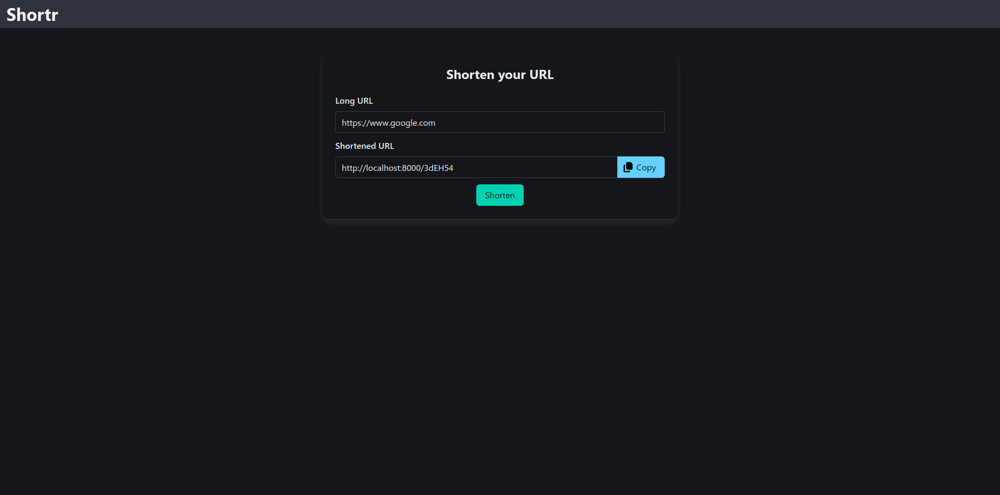

# Shortr

## Project Goals and Intentions

This project aims to provide a simple and efficient URL shortening web application. Users can input a long URL and receive a unique, shortened link that redirects to the original destination.

## Core Features

- **URL Shortening:** Easily shorten long URLs into concise, unique short codes.
- **Unique Short Code Generation:** Short codes are derived from the link's ID using the Sqids library.
- **Redirection:** Shortened URLs redirect users to their original long URL.
- **Copy to Clipboard:** Convenient button to copy the generated short URL.
- **Responsive UI:** Styled with Bulma CSS framework for a clean and responsive design.
- **Dynamic Interactions:** Utilizes HTMX for seamless form submissions and UI updates without full page reloads.

## Technology Stack

- **Backend (Django):** Chosen for its "batteries-included" approach, providing a robust framework for rapid web development.
- **Frontend (HTMX):** Enhances user experience with dynamic updates and AJAX capabilities, minimizing complex JavaScript.
- **Styling (Bulma):** A modern CSS framework for a responsive and aesthetically pleasing user interface.
- **Database (PostgreSQL):** A powerful and reliable open-source relational database for data storage.
- **Short Code Generation (Sqids):** Used for generating unique, non-sequential short codes from numerical IDs.
- **Containerization (Docker Compose):** Ensures a consistent and reproducible development environment.
- **Package Management (uv):** For high-performance Python package management.

## Running Locally with Docker

To run Shortr locally using Docker, follow these steps:

1.  **Environment Configuration:**
    Before starting the application, ensure you have configured your environment variables. You can either:
    - Modify the `base.env` file directly in the project root directory.
    - Create an `override.env` file in the project root directory to override specific variables from `base.env`.
      Ensure you fill in the missing values, especially for database credentials.

2.  **Build and Run with Docker Compose:**
    Navigate to the project's root directory in your terminal and execute the following command:

    ```bash
    docker compose up --build
    ```

    This command will build the Docker images and set up the necessary services (web, database).

3.  **Access the Application:**
    Once the services are up and running, you can access the Shortr application in your web browser at:

    ```
    http://localhost:8000
    ```

    It might take a few moments for the database to initialize and the Django application to start completely.

## Screenshots

<div style="text-align: center;">
  
  <p style="margin-top: 5px; font-style: italic;">Home Page - Input for Long URL</p>
</div>

<div style="text-align: center;">
  
  <p style="margin-top: 5px; font-style: italic;">Shortened URL Result with Copy Option</p>
</div>
